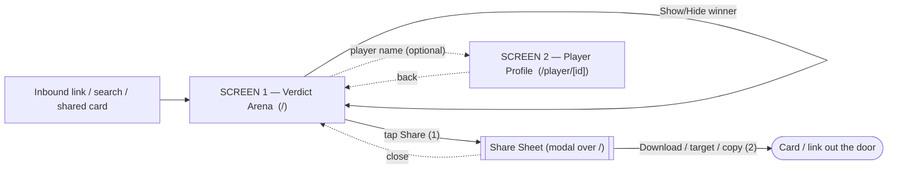

# CompareGOATs — UX (Phase 10, Agent A)

> Pure UX: users, jobs, the minimal screen set, the flow, the information
> architecture and the interaction model. **No visual/brand design here** —
> that is Agent B's job. Companion artifact: the bare wireframe route
> `/wireframe` (`src/app/wireframe/page.tsx`).

---

## 1. User & Jobs-to-be-Done

### Who lands
- **The arguer (primary).** Mid-argument with a friend ("Messi or Ronaldo?").
  Arrives from a social link, a search, or a friend's shared card. Wants
  ammunition *now*. Mostly on a phone, mostly impatient.
- **The content-maker (secondary).** Wants a clean, shareable image to post with
  their own caption. Cares about the card looking good and downloading fast.
- **The curious browser (tertiary).** No fixed agenda; pokes around categories.
  Real, but must never dictate structure — they are served *for free* by the
  same screen the arguer uses.

### The one job (JTBD)
> "When I'm arguing about who's better, I want to settle it **by the numbers**
> and **send proof**, so I win the argument without doing research."

Two sub-jobs fall out of it:
1. **Settle** — see a defensible verdict (score by categories) immediately.
2. **Share** — get that verdict out as an image/link in as few taps as possible.

"Dig into a specific category" is a *third, optional* job — supportive, never a
gate on the first two.

### Design consequence (the spine of everything below)
The product unit is the **verdict**, and the deliverable is the **card**. So the
verdict must be **on the landing screen, above the fold, with zero clicks**, and
**Share must be reachable from the verdict in one tap**. Anything that sits
*between* landing and the verdict is friction and gets cut.

---

## 2. Primary scenarios (step-by-step, counted)

### Scenario A — "Settle + share" (the money path) — measured in taps
The whole reason the product exists. Target: **fewest possible taps to a shared
card.**

| # | User action | System response |
|---|---|---|
| 0 | Lands on `/` (from link/search/social) | Verdict screen renders: both players, **VS**, **final score by categories**, breakdown list, one **Share** button — all visible, no click. |
| 1 | **Tap "Share"** | Share sheet opens with a live card preview + prefilled caption. |
| 2 | **Tap "Download"** (or a platform target / Copy link) | PNG downloads / native share sheet fires / link copied. |

**= 2 taps from cold landing to a shared card.** Reading the verdict itself is
**0 taps** (it's the landing). This is the number the whole IA is optimised for.

> If the arena home still funnels through `/compare → /verdict` before a verdict
> is visible, the same job costs **3+ taps and 2 full page loads** before the
> user even *sees* a score. That is the core waste this redesign removes.

### Scenario B — "Settle, then dig, then share" (the engaged path)
The arguer wants to challenge one specific claim ("but his Champions League
record…").

| # | User action | System response |
|---|---|---|
| 0 | Lands on `/` | Verdict + category breakdown visible. |
| 1 | Tap a **category** in the breakdown | That category expands in place (progressive disclosure): the metric rows + the two values + who leads. No navigation. |
| 2 | (optional) Tap **"Hide winner"** | Score/crowns/leaders hide → neutral number-only mode (lets the user make their *own* point, screenshot-safe). |
| 3 | Tap **Share** → **Download** | Card (respecting the current category selection + winner toggle) is produced. |

Still terminates in the **same 2-tap share**. Digging is *additive*, never a
detour off the path.

---

## 3. Minimal screen set + flow

### The cut — current 5–6 destinations → **2 screens + 1 sheet**

```
                         BEFORE (Phase 9)                         AFTER (Phase 10)
   ┌───────────────────────────────────────────┐      ┌──────────────────────────────┐
   │ /  arena home  (renders, tabs, partial     │      │ /  VERDICT ARENA              │
   │    verdict, "Start comparison" CTA)        │      │   renders + VS + full verdict │
   │            │  ▼                            │      │   + category breakdown        │
   │ /compare   category picker (gate)          │      │   (expand in place)           │
   │            │  ▼                            │      │   + Show/Hide-winner toggle   │
   │ /verdict   the actual score                │ ───▶ │   + Share                     │
   │            │  ▼                            │      │           │ tap Share         │
   │ /cards     FUT collectible battle          │      │           ▼                   │
   │ share modal (from 3 places)               │      │   ┌─────────────────────┐     │
   │ /player/[id]  profile pages               │      │   │  SHARE SHEET (modal) │     │
   └───────────────────────────────────────────┘      │   │  preview + caption + │     │
                                                       │   │  download/targets    │     │
                                                       │   └─────────────────────┘     │
                                                       │ /player/[id]  PROFILE (kept,  │
                                                       │   off-path reference)         │
                                                       └──────────────────────────────┘
```

### Flow diagram (kept set)



### Screen-by-screen verdict: keep / cut / merge

| Screen (Phase 9) | Decision | Why |
|---|---|---|
| **`/` arena home** | **KEEP — promoted to the whole product.** | It already has the renders, VS and tabs. We pull the *real verdict* (score, breakdown, share) up onto it so the job is done on first paint. It stops being a teaser and becomes the answer. |
| **`/compare` category picker** | **CUT as a screen → MERGE inline.** | A dedicated screen whose only output is a URL param is a gate in front of the verdict — it adds a page load and a decision before the user has seen anything. Sensible default = **all categories on**; refinement becomes an *optional* inline control on Screen 1 (tap categories in the breakdown to include/exclude, or "Hide winner"). 99% of users never needed to pick categories to get value. |
| **`/verdict` result page** | **CUT as a screen → MERGE into `/`.** | This *was* the payoff, hidden two clicks deep. The payoff belongs on the landing. Its content (crowned score, breakdown, final score, share/download) moves onto Screen 1. The shareable `?cats=` deep link is preserved on `/` so links keep working. |
| **`/cards` FUT battle** | **CUT.** | The brief's product is "settle by the **numbers** + share." FUT cards carry **cosmetic, non-real ratings** (explicitly labelled as decorative) — they dilute the core promise ("neutral by facts"), add a whole screen, and split Share across three origins. It's the clearest "лишнее" (excess) to remove. The *card aesthetic* energy Agent B wants belongs in the **share card output**, not as a separate destination. |
| **Share modal** | **KEEP — single source of truth.** | The terminal step of the only job. Now triggered from exactly **one** place (Screen 1's Share button) instead of three, so behaviour is consistent. Stays a modal/sheet over `/`, not a route — it's a terminal action, not navigation. |
| **`/player/[id]` profiles** | **KEEP — but demoted to off-path reference.** | Not part of the settle+share spine, so it earns its place only as *optional depth* for the curious browser (full career stats). Reachable by tapping a player's name on `/`; never blocks or appears in the main flow. Could be cut for a pure-MVP, but it costs the core path nothing (it's a leaf) and answers real follow-up questions ("what were his actual league goals?"). **If forced to one screen, this is the next to go.**

**Counts: kept = 2 screens (`/`, `/player/[id]`) + 1 sheet (Share). Cut = 2 screens (`/compare`, `/cards`). Merged-into-`/` = 1 (`/verdict`).**
Net: from **5 routed destinations + modal** down to **2 routes + 1 sheet** — the
settle+share job now lives entirely on one screen.

---

## 4. Information architecture + interaction model

### SCREEN 1 — Verdict Arena (`/`) — does the whole job

**Content blocks, top → bottom (hierarchy = importance to the job):**

1. **Clash header (identity + verdict, the hero).** The two player renders facing
   a central **VS**, and *immediately* the **score by categories** ("RONALDO N — M
   MESSI" + "M categories won"). This is the answer; it is the single most
   important block and must be above the fold on mobile. Each player's
   name/club/flag sits with their render.
2. **Category breakdown (the evidence).** A vertical list, one row per category
   (Goals, Assists, Trophies, Ballon d'Or, Champions League, World Cup,
   Playmaking, Longevity). Each row: category label + the two headline values +
   who leads (a small leader marker). Default: **all categories counted.**
   - **Interaction — tap a row → expands in place** (progressive disclosure)
     to show that category's sub-metrics (e.g. career goals, intl goals, league
     goals, conversion) with both values and per-metric leader. Tap again to
     collapse. No navigation, no page load.
   - **Interaction — toggle a row's "count this" checkbox** (the merged-in
     `/compare` function): excluding/including a category **recomputes the score
     live** and updates the URL `?cats=`. Minimum sensible count enforced
     (fall back to all if too few). This is the *only* remnant of the old picker —
     now inline and optional.
3. **Winner toggle: "Show winner / Hide winner".** A single switch governing all
   verdict-ish UI. **Default ON.** OFF → hide score, crowns, leaders, "why" →
   neutral number-only mode (so a user can present raw numbers and draw their own
   conclusion, or screenshot a neutral card). Mirrors the existing
   `showWinner` model so it flows straight into the share card.
4. **Share (the exit).** One primary action: **"Share verdict"**. Opens the Share
   Sheet. This is the screen's single primary CTA; everything else is secondary.
5. **Trust line (small print).** "Accurate as of {date} · {scope}" + a quiet note
   that figures are by category, never "X is better" (honesty per SPEC §3).

**Control behaviour:**

| Control | On tap/click | State it changes |
|---|---|---|
| Category row (label area) | Expand/collapse its sub-metrics in place | local: which row is open |
| Category row "count" checkbox | Include/exclude from score; recompute; update `?cats=` | verdict score + URL |
| Show/Hide-winner switch | Toggle verdict visibility everywhere on screen + in the would-be card | `showWinner` |
| **Share verdict** (primary) | Open Share Sheet, seeded with current `cats` + `showWinner` | opens sheet |
| Player name / render | Navigate to that player's profile (off-path) | route → `/player/[id]` |

**Key states:**
- **Default:** all categories counted, winner shown, no row expanded.
- **Winner-hidden:** neutral mode (numbers only, no leader/score language).
- **Refined selection:** subset of categories counted; score reflects subset; URL
  carries it so the link is shareable and restores on load.
- **Deep-linked (`/?cats=…` / `/?share=1`):** restore the selection from URL; if
  `share=1`, auto-open the Share Sheet (preserves existing behaviour so old
  shared links keep working).
- **Loading:** verdict is computed server-side from the dataset → first paint is
  the real answer; no client spinner needed for the verdict. Only the *card
  preview/PNG* in the sheet has an async/loading state.
- **Empty / error:** verdict is deterministic from bundled data, so "no data" is
  not a normal state; if the dataset ever fails, show a single honest message in
  place of the breakdown rather than a broken score. Card download failure shows
  an inline retry message in the sheet (already implemented).
- **Mobile (~390) vs desktop (1440):**
  - *Desktop:* renders flank the VS in a 3-column clash; the breakdown can sit
    below full-width; toggle + Share sit together under the verdict.
  - *Mobile:* everything **stacks** — Player A, VS, Player B, then score, then
    breakdown, then toggle, then Share. The clash header must compress so the
    **score is reachable with ≤1 short scroll**; renders shrink before the score
    does. Category rows are full-width, tap targets ≥44px. Share is a full-width
    button; on devices with the Web Share API it can fire the native sheet.

### SHARE SHEET (modal over `/`) — the terminal action

**Content blocks:**
1. **Live card preview** — the real share card, scaled (the actual output, not a
   mockup), reflecting current `cats` + `showWinner`.
2. **Editable caption** — prefilled (winner + score, or neutral), with hashtags;
   user can edit before sending.
3. **Primary: Download PNG.** The MVP's main export (SPEC §9).
4. **Targets row:** native/Web-Share, X, copy-link (deep link back to `/?share=1&cats=…`).
5. **Close (X / Esc / scrim).**

**Interaction & states:** focus-trapped dialog, Esc/scrim/X to close, focus
restored on close (already implemented); Copy → transient "Copied" confirmation;
Download → loading → success (file) or inline error+retry; caption re-seeds when
the underlying selection/locale changes. **Mobile:** the sheet is full-width and
scrollable; preview on top, controls below (single column). **Desktop:** preview
left, controls right.

**Why a sheet, not a route:** it's a *terminal action* on the verdict, not a
place you navigate "to" and "back" from. A modal keeps the user anchored on the
verdict (UX rule: don't use modals for primary *navigation* — but a one-shot
terminal action is exactly what a sheet is for) and keeps Share behaviour
single-sourced.

### SCREEN 2 — Player Profile (`/player/[id]`) — optional depth (off-path)

**Content blocks:** player identity header; career totals; season-by-season
output; competition breakdown; honours. Read-only.
**Role in IA:** a *leaf* off Screen 1, reached by tapping a player. Never part of
the settle+share spine; never linked into the main CTA chain. Has a clear,
predictable **back to `/`**. Exists to answer "show me the actual numbers behind
this" for the curious/skeptical user without bloating the core path.
**States:** default (data), 404 for any non-{messi,ronaldo} id (already handled).

---

## 5. Rationale — why this is *considered*, not a skeleton-copy of refs

1. **The verdict is the landing, not a reward two clicks away.** The biggest flaw
   of the Phase-9 structure is that it *copied the reference's screen sequence*
   (arena → pick → result → cards) without asking what the user actually needs
   first. The user needs the *answer*. Putting the score on `/` collapses the job
   from 3+ navigations to **2 taps total** (both of which are the *share*, not
   the *settle*). Settling is now instantaneous.

2. **Category selection was a gate; it's now an affordance.** Forcing every user
   through a picker to produce a URL param optimised for the rare power-user at
   the expense of everyone. Defaulting to "all categories" and exposing refine +
   winner-toggle *inline* serves the power-user **without** taxing the majority —
   progressive disclosure instead of an upfront wall.

3. **Cutting `/cards` sharpens the promise.** The product's moat is "**neutral by
   facts** + frictionless share." A whole screen of *cosmetic* FUT ratings
   undercuts the neutrality and forks the Share path three ways. Removing it
   makes the message singular and the codebase's Share behaviour single-sourced.
   The card *energy* the boss wants is redirected to where it actually ships —
   the **share-card image** — which is the real viral artifact.

4. **One primary action per screen.** Screen 1 has exactly one primary CTA
   (Share); the toggle, category taps and profile links are clearly secondary.
   This is the opposite of the current home, which competes "Start comparison" vs
   "View cards" vs an in-page Share before the user has a reason to choose.

5. **State lives in the URL, so sharing is lossless and the back button is
   honest.** `?cats=` and `?share=1` keep every verdict deep-linkable (a shared
   link reopens the *exact* verdict, even auto-opening the sheet) and keep
   browser Back predictable — no modal-as-route, no stack resets.

6. **Honesty is structural, not decorative.** "By N categories", never "X is
   better"; the Hide-winner mode and the trust line are first-class blocks, not
   afterthoughts — they're what makes the card *credible* enough to actually win
   an argument.

7. **"Без лишнего" taken literally.** Every kept element maps to a line in §1's
   job: renders+VS+score = *settle*; breakdown = *evidence*; toggle = *honesty /
   own-point*; Share = *exit*; profile = *optional proof*. Nothing on the path
   exists "because the reference had it."

---

## 6. Open questions for the manager / Agent B
- **Profiles in or out?** Kept as off-path depth; if the manager wants the
  absolute minimum, `/player/[id]` is the one screen left to cut (it costs the
  core path nothing, so the recommendation is keep).
- **Inline category refine vs. a small "advanced" disclosure?** Proposed as
  per-row checkboxes inside the breakdown; if that feels heavy, it can hide behind
  a single "Customise categories" expander to keep the default view dead simple.
- **Mobile clash compression:** Agent B must ensure the renders never push the
  score below ~1 short scroll on a 390px screen — the score is the hero.
